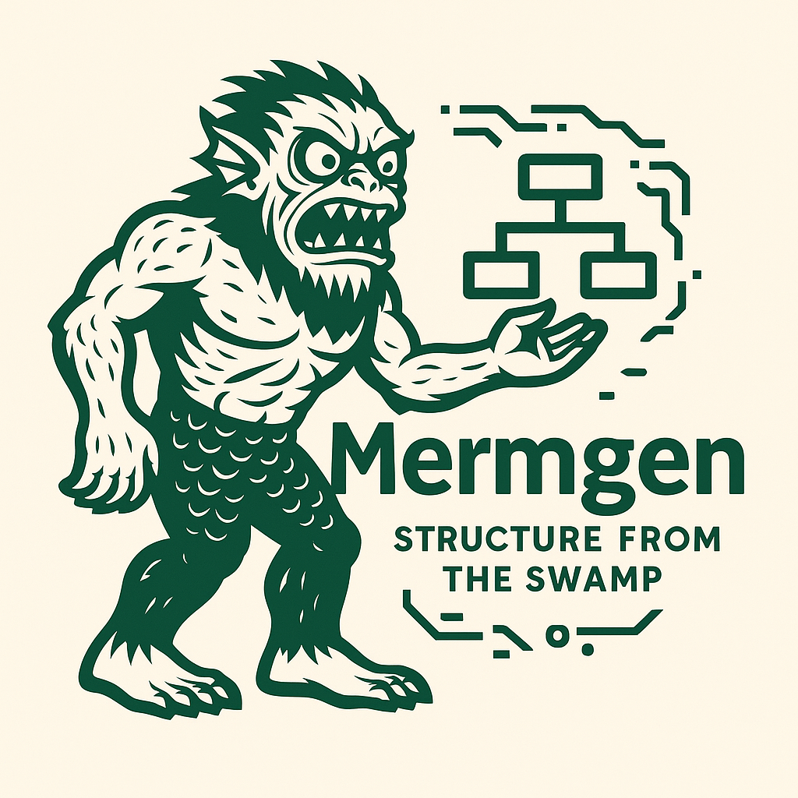
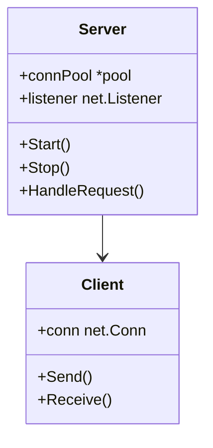
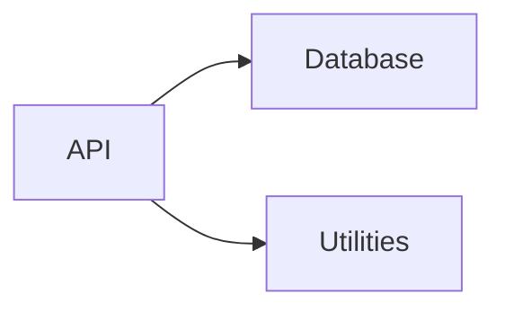

# MermGen (WIP)
Structure from the Swamp



MermGen is a tool that generates Mermaid diagrams from Go projects using AI agents.

## Features

- Clone Go repositories from GitHub
- Parse Go code using Tree-sitter
- Generate Mermaid diagrams using AI agents

## Requirements

- Go 1.21+
- Tree-sitter
- Git
- Google API key for Gemini

## Installation

```bash
go get github.com/Nurozen/mermgen
```

## Usage

Set your Google API key as an environment variable:

```bash
export GOOGLE_API_KEY="your-api-key"
```

Run the tool:

```bash
# Generate diagrams for a GitHub repository
mermgen -repo github.com/user/repo -output diagrams/

# Specify specific diagram types (coming soon)
mermgen -repo github.com/user/repo -output diagrams/ -diagram class,sequence
```

## Example Output

MermGen creates Markdown files containing Mermaid diagrams:

### Class Diagram Example


### Package Diagram Example


## Development

To contribute to MermGen:

1. Clone the repository
2. Install dependencies: `go mod download`
3. Make your changes
4. Run tests: `go test ./...`
5. Submit a pull request 
